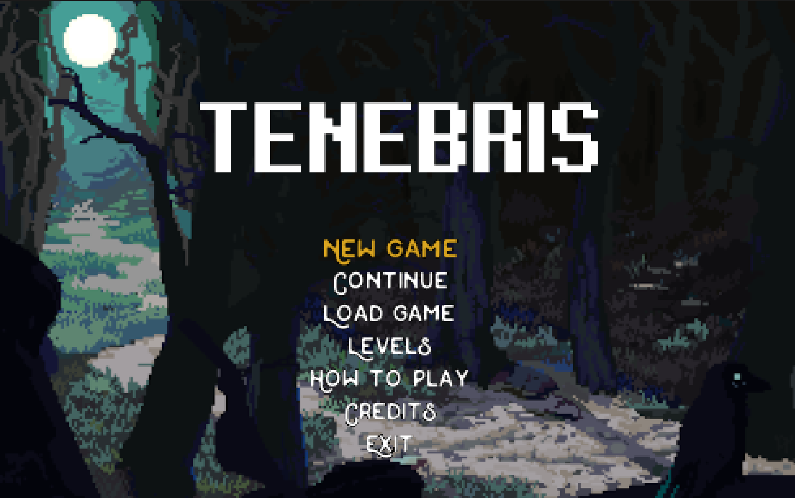

# LDTS T14G01 - TENEBRIS  

## Game Description

> A character named Dylan Macron finds himself jumping from arena to arena, fighting for his life. Each arena is filled with monsters of various types, all determined to kill him. Starting out relatively powerless, Dylan grows stronger with each fight as he gains experience. He has two weapons at his disposal: a simple Pistol and a Grenade Launcher. Dylan has only one life per level. If he dies, he will respawn at the beginning of the level and can continue fighting. However, if he dies on the hardest difficulty level, it’s game over.

This project was developed by [Cláudio Meireles](https://github.com/Atum555) (up202306618), [Dinis Silva](https://github.com/DinisBSilva) (up202306207) and [Miguel Pereira](https://github.com/migalha212) (up202304387).

For a more detailed version of this description click [here](./docs/README.md).

## Implemented Features
Here we decided to present only the features itself without thei description, since the full list, present [here](./docs/README.md), is very extensive.

### Controls
Keys used to interact with the game.

### Menu System
We implemented a Menu System that lets you navigate through the menus of the game and their options.

We have developed the following menus:
- **Main Menu**
- **New Game Menu**
- **Load Game Menu**
- **Levels Menu**
- **How to Play Menu**
- **Credits Menu**
- **Pause Menu**
- **Level Completed Menu**
- **Victory Menu**
- **Death Menu**
- **Game Over Menu**
  
### Dylan and Monsters Alive Detection

### Screen Resizer and Screen Size Locker

### Collision Detection and Damage Detection

### Arena Builder

### Sprite Image Loader

### Save, Sound, Animation and Effect Systems

### Difficulty Levels

### Game Elements

### Player and Monsters Movement

### Weapons

## Game Screenshots and Gameplay Showcase

[comment]: <> (Dylan Movement Showcase)

<h3 align="center">
  Dylan Movement Showcase
</h3>

[comment]: <> (Gameplay Showcase)

<h3 align="center">
  Gameplay Showcase
</h3>

[comment]: <> (Menu Design Example)

<h3 align="center">
  Main Menu Design
</h3>

[comment]: <> (Arena Design)

<h3 align="center">
  Arena Design
</h3>

## Classes Structure Overview UML

