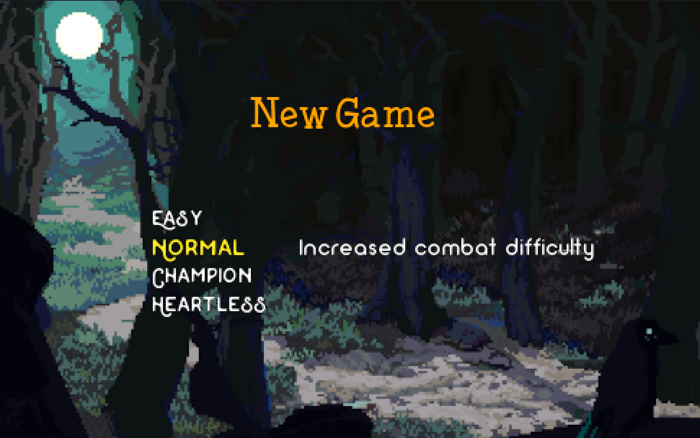
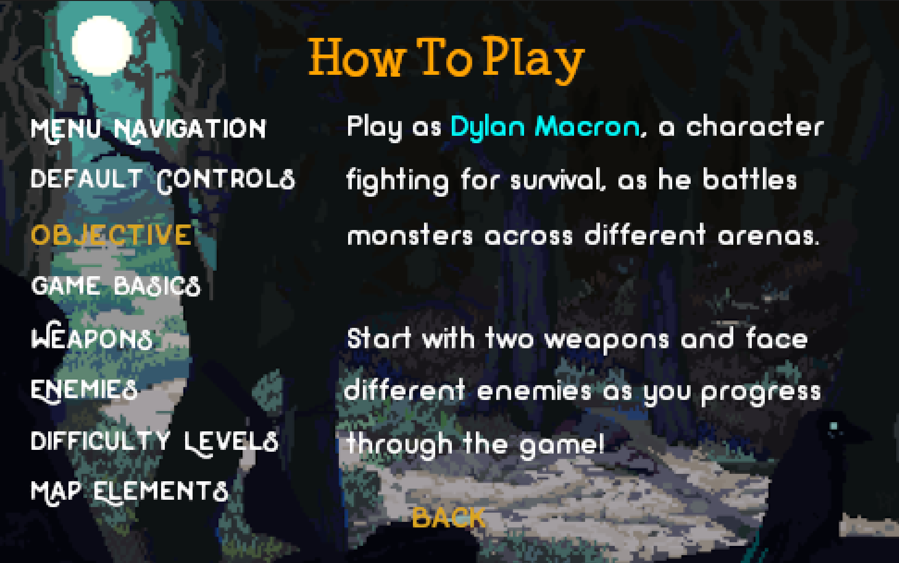
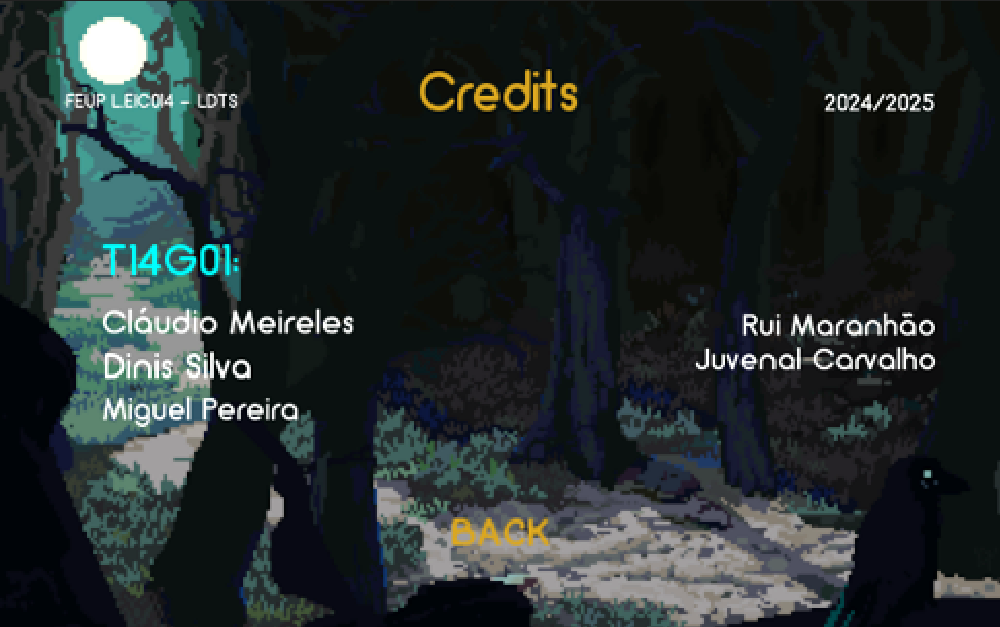

# LDTS T14G01 - TENEBRIS  

## Game Description

>A character named Dylan Macron finds himself jumping from arena to arena, fighting for his life. Each arena is filled with monsters of various types, all determined to kill him. Starting out relatively powerless, Dylan grows stronger with each fight as he gains experience. He can find weapons scattered around the arenas, and there are three types: Simple Shot, Explosion Shot, and Death Ray. Each shot consumes energy, which regenerates slowly and can also be dropped by defeated monsters. Dylan has only one life per level. If he dies, he will respawn at the beginning of the level and can continue fighting. However, if he dies on the hardest difficulty level, it’s game over.

This project was developed by [Cláudio Meireles](https://github.com/Atum555) (up202306618), [Dinis Silva](https://github.com/DinisBSilva) (up202306207) and [Miguel Pereira](https://github.com/migalha212) (up202304387).

For a more detailed version of this description click [here](./docs/README.md).

## Implemented Features

### Main Menu
First menu of the game. It will show up when opening the game and from here you can select one of the following options:

- **New Game**: Allows you to create a new game and select the difficulty.
- **Load Game**: Allows you to access and continue a previously saved game session.
- **Levels**: This option just appears if you have already some saved game session. It is used to select one of the unlocked levels to play next.
- **Statistics**: Displays informations such as kills, deaths, levels completed, etc. of the current session.
- **How to Play**: Explains you how you can play the game.
- **Credits**: Shows the credits of the game.
- **Exit**: Exits the Game.

> Load Game, Levels and Statistics options only appear once the player has at least one saved game.

### New Game Menu
Allows players to select their preferred difficulty level. [Options](#difficulty-levels) include Easy, Normal, Champion and Heartless, each accompanied by a brief description to guide the player. Once a difficulty is selected, the game proceeds to start.

### How to Play Menu
Provides essential gameplay information, including navigation, controls, objective (of the game), the game basics and details about weapons, enemies, bosses, difficulty levels, and map elements. Navigation instructions are shown on the right, with options to move through the menu or go back.

### Credits Menu
A simple text-based screen that highlights the individuals who contributed to the development of the game and the purpose behind its creation. It provides a straightforward way to acknowledge the team. The menu includes a single option to return to the Main Menu, ensuring easy navigation.

### Screen Resizer
At the game's launch, the code dynamically detects the user's screen resolution to ensure that the game's proportionality remains consistent, regardless of the screen size. This approach guarantees that the full game window is always displayed without being cropped or cut off, providing an optimal experience across various screen resolutions.

### Screen Size Locker
This feature prevents the user from resizing the game window, ensuring the game’s layout and functionality remain intact. If the user attempts to adjust the window size, the code detects this action, closes the current window, and reopens a new one with the predefined dimensions. The new window restores the exact state of the previous one, preserving all content and progress seamlessly.

### Collision Detection
Although it is not yet fully apparent in gameplay due to ongoing feature development, the game already incorporates a collision detection mechanism. This system will be a crucial part of the game, determining whether entities can move to specific positions and if monsters successfully deal damage to Dylan.

## Game Screenshots and Mockups

[comment]: <> (Main Menu Design)

<h3 align="center">
  Main Menu Design
</h3>

[comment]: <> (New Game Menu Design)

<h3 align="center">
  New Game Menu Design
</h3>

[comment]: <> (How to Play Menu Design)

<h3 align="center">
  How to Play Menu Design
</h3>

[comment]: <> (Credits Menu Design)

<h3 align="center">
  Credits Menu Design
</h3>

[comment]: <> (Arena Design)

<h3 align="center">
  Arena Design
</h3>

## UML Class Structures and Overview

