# **LDTS T14G01 - TENEBRIS**

## **Game Description**

A character named Dylan Macron finds himself jumping from arena to arena, fighting for his life. Each arena is filled with monsters of various types, all determined to kill him. Starting out relatively powerless, Dylan grows stronger with each fight as he gains experience. He has two weapons at his disposal: a simple Pistol and a Grenade Launcher. Dylan has only one life per level. If he dies, he will respawn at the beginning of the level and can continue fighting. However, if he dies on the hardest difficulty level, it’s game over.

> This project was developed by [Cláudio Meireles](https://github.com/Atum555) (up202306618), [Dinis Silva](https://github.com/DinisBSilva) (up202306207) and [Miguel Pereira](https://github.com/migalha212) (up202304387).

## **Table of Contents**
- [Controls](#controls)
- [Implemented Features](#implemented-features)
- [Design Patterns](#design-patterns)
- [Code Smells](#code-smells)
- [Coverage Report](#coverage-report)
- [Pitest Report](#pitest-report)

## Controls
```W```: Moves Player up.  

```A```: Moves Player left.  

```S```: Moves Player down.  

```D```: Moves Player right.  

```↑```: Player Looks up.  

```←```: Player Looks left.  

```↓```: Player Looks down.  

```→```: Player Looks right.  

> Dylan shoots in the direction he is looking.

> Arrow Keys are also used to navigate throw the Menus.

```Space```: Shoot.

```R```: Reload. 

```Q```: Quits Game.

```ESC```: Return to the previous menu (or quit game if you are in Main Menu). 

> Can be also used to open the Pause Menu while in-game. 

```ENTER```: Select the desired options in the menu.  

## **Implemented Features**
    
### Main Menu
First menu of the game. It will show up when opening the game and from here you can select one of the following options:

- **New Game**: Allows you to create a new game and select the difficulty.
- **Continue**: Allows player to enter in the last session played without needing to navigate through the Load Game Menu.
- **Load Game**: Allows you to access and continue a previously saved game session.
- **Levels**: This option just appears if you have already some saved game session. It is used to select one of the unlocked levels to play next.
- **How to Play**: Explains you how you can play the game.
- **Credits**: Shows the credits of the game.
- **Exit**: Exits the Game.

> Continue, Load Game and Levels options only appear once the player has at least one saved game.

<p align="center">
  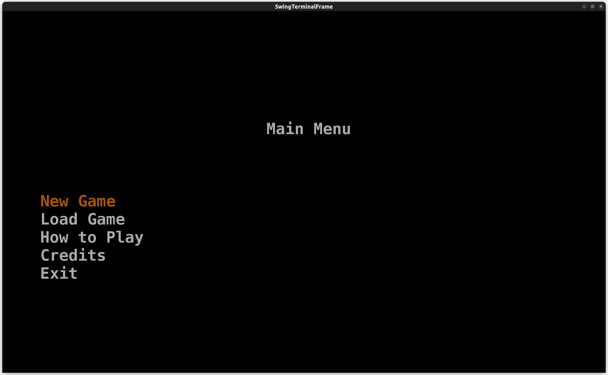
</p>

### New Game Menu
Allows players to select their preferred difficulty level. [Options](#difficulty-levels) include Easy, Normal, Champion and Heartless, each accompanied by a brief description to guide the player. Once a difficulty is selected, the game proceeds to start.

<p align="center">
  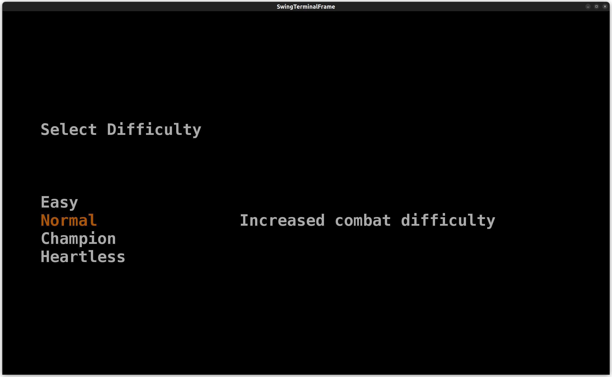
</p>

### Load Game Menu
Allows players to select and load previously saved game progress. It also provides info about the selected load such as the maximum level reached and the current difficulty level.

<p align="center">
  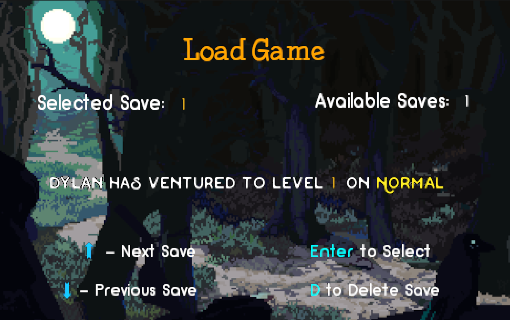
</p>

### Levels Menu
This menu allows player to replay any of the levels achieved until that moment on the current selected save.

<p align="center">
  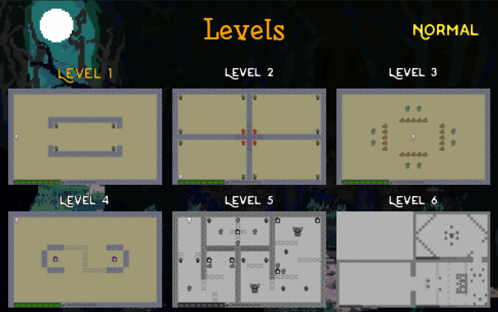
</p>

### How to Play Menu
Provides essential gameplay information, including navigation, controls, objective (of the game), the game basics and details about weapons, enemies, bosses, difficulty levels, and map elements. Navigation instructions are shown on the right, with options to move through the menu or go back.

<p align="center">
  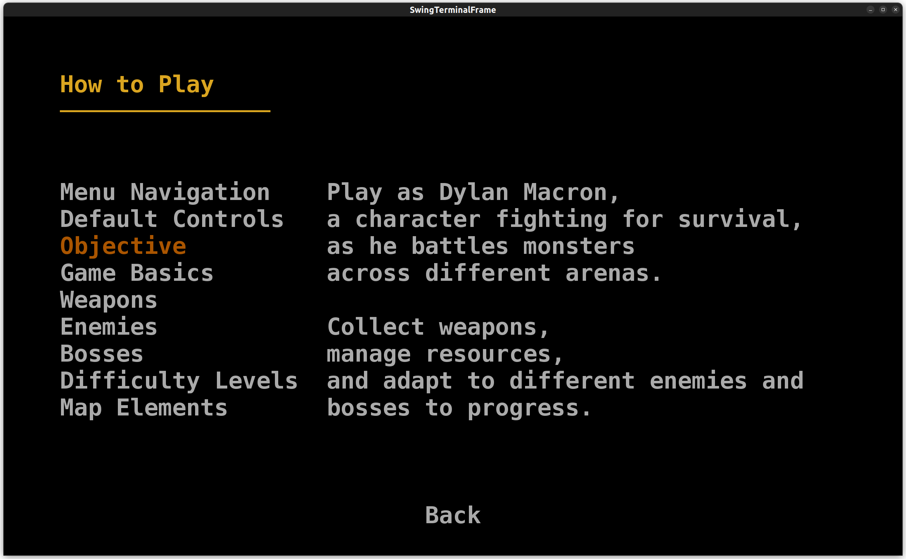
</p>

### Credits Menu
A simple text-based screen that highlights the individuals who contributed to the development of the game and the purpose behind its creation. It provides a straightforward way to acknowledge the team. The menu includes a single option to return to the Main Menu, ensuring easy navigation.

<p align="center">
  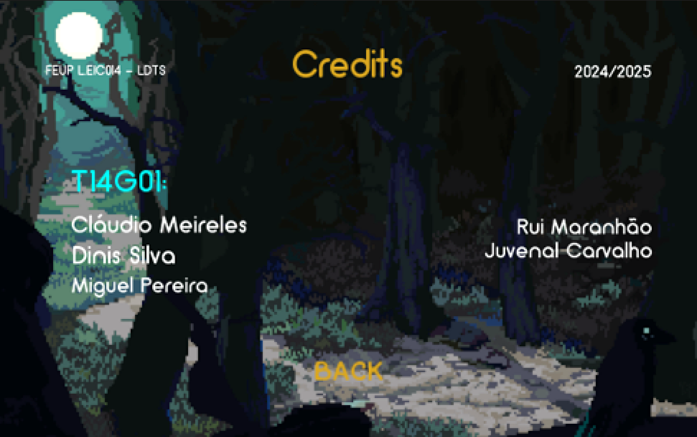
</p>

### Pause Menu

This menu can be opened while in-game. It lets you pause your game and gives you some options such as:

- **Continue** : Unpauses the game.
- **Restart Level** : Reloads the current level.
- **Return to the Main Menu** : Goes to Main Menu.

<p align="center">
  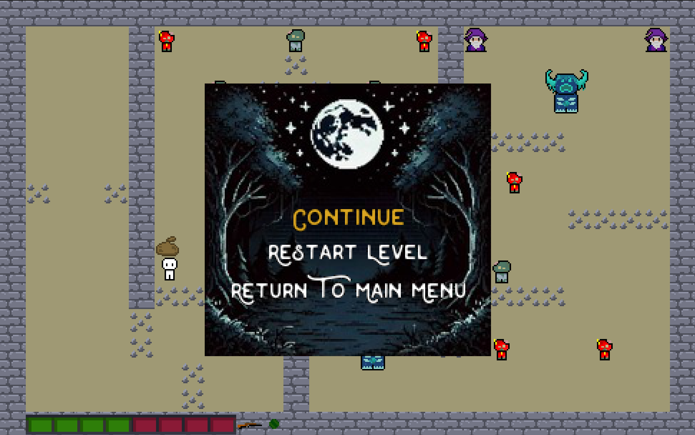
</p>

### Level Completed Menu
Menu that appears when player sucessfully kills all monsters of the current level, without dying, giving him the options to go to the next level or to return to the main menu. For this menu to appear on the correct timings we have developed a system that detects if there is still any monster alive.

<p align="center">
  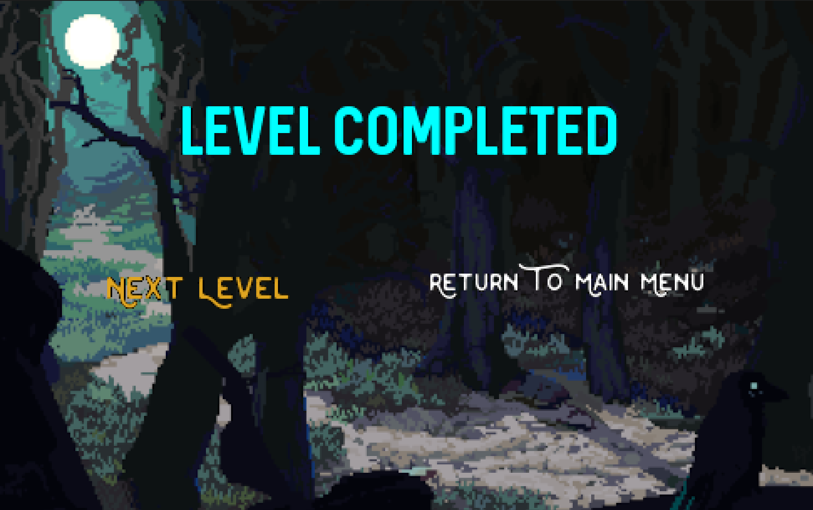
</p>

### Victory Menu
Menu that appears when player succesfully completes the last level of the game. The only option is to return to the main menu.

<p align="center">
  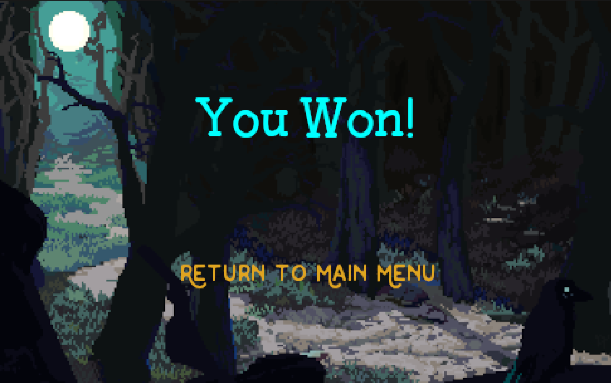
</p>

### Monsters Alive Detection
This system detects if there is still monsters alive. It is useful to understand if the Player completed sucessfully the level or not.

### Death Menu
Menu that appears when player dies, giving him the options to retry the current level or return to the main menu. For this menu to appear on the correct timings we have developed a system that detects if Dylan is still alive.

<p align="center">
  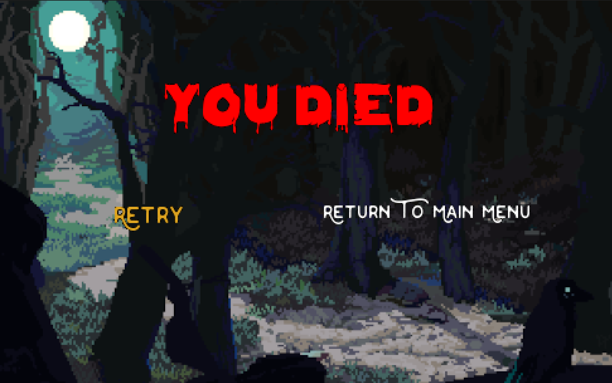
</p>

### Game Over Menu
Menu that appears if player dies on the Heartless Difficulty, once there is no second chance on that difficulty. The only option is to return to the main menu.

<p align="center">
  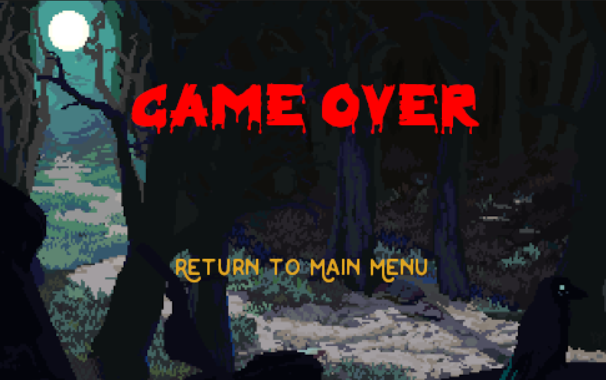
</p>

### Dylan Alive Detection
Useful to understand if player lost the game, by detecting if he died.

### Collision Detection
This system is a crucial part of the game, determining whether Game Elements collide with another, and if so calls the right interactions.

### Damage Detection System
Entities can lose HP from interactions (namely, attacks of other Entities or hitting spikes). As different entities have different HP's we needed to track their current HP's and reducing it accordingly to the Damage that is taken, resulted by the interaction.

### Arena Builder 
System that is capable to create the different arenas for each level from written text files with specific characters, allowing to generate static elements and the starting position of the Entities. This system makes it easier to create newer levels without having the need to change the code.

### Sprite Image Loader
A system that loads PNG images into the game representing them pixel by pixel on the screen, using Lanterna. This is used through everything that you can see on the game terminal.

### Save System
We developed a mechanism that stores the necessary game information, such as player progress and the difficulty level of that session, into a .txt file with the aim of letting the player continue that session latter if he wants so.

### Sound System
In order to create a more immersive experience for the player, we added music and sounds to our game. Different musics play during the menus and in-game. As for sounds, they are used to signal moves in menus and in-game interactions.

### Animation System
We implemented some animations such as bounce and camera shake. Bounces occur when an Entity collides with a Game Element and Camera shakes whenever an explosion occurs. We developed a general use Animation System and then created the specific cases. We decided to do that to improve maintenance and scability.

### Effect System
We implemented an effect, the explosion one. Even though it is only one effect, we created a system that lets you implement new effects relatively easy.

### Screen Resizer
At the game's launch, the code dynamically detects the user's screen resolution to ensure that the game's proportionality remains consistent, regardless of the screen size. This approach guarantees that the full game window is always displayed without being cropped or cut off, providing an optimal experience across various screen resolutions.

### Screen Size Locker
This feature prevents the user from resizing the game window, ensuring the game’s layout and functionality remain intact. If the user attempts to adjust the window size, the code detects this action, closes the current window, and reopens a new one with the predefined dimensions. The new window restores the exact state of the previous one, preserving all content and progress seamlessly.

### Difficulty Levels

- **Easy**

- **Normal**

- **Champion**

- **Heartless**
    
Monsters become increasingly stronger the higher the difficulty chosen.
In addition, there are also some changes worth highlighting:

- **Easy**:
  - Dylan has a bigger starting HP.

- **Heartless**:
  - Champion difficulty level but if you die, game over!
  
### **Game Elements**
All Game Elements (entities, camera, projectiles, particles and static elements) are defined by their position, hitbox and the correspondent animation.

### Entity  
    
The entities in the game are Dylan (our player) and the monsters. While they share some common attributes, they also have distinct characteristics:

**Shared Attributes:**
- **Position** : a vector with 2 dimensions that represents the current position of the Entity.
- **Hitbox** : a virtual boundary around the Entities, used to detect collisions and/or interactions.
- **Health Points** (HP) : the amount of damage an Entity can take before dying.
- **Velocity** :  the speed at which an entity can move, measured in units per second.

**Distinguishing Attributes:**
- Monsters:
  - **Damage** (DMG) : the amount of HP that is taken away from an entity in the interaction (Monsters only).
  - **Vision Range**: the distance that an Monster can detect Dylan and consequently react to him.
- Dylan:
  - **List of weapons and Selected Weapon**: these two combined represent our system of weapons. 

### Camera
Implemented with the objective of making levels with more than one arena (as shown on the level 6 of the game). it is responsible for changing the arena displayed to the player whenever he passes the limits of one arena and enters another. 

[comment]: <> (Camera Showcase)

<h3 align="center">
  Camera Showcase
</h3>

<p align="center">
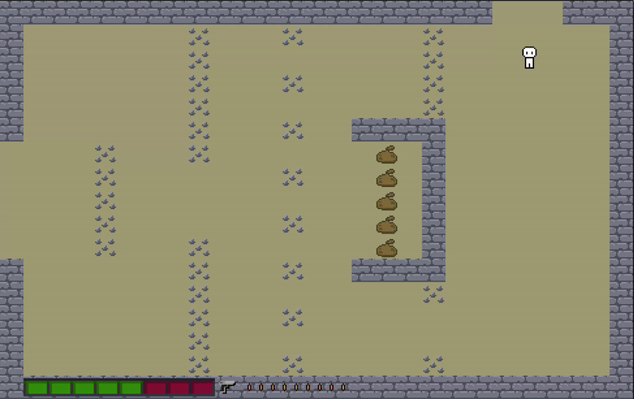
</p>

    
### Projectiles
Projectiles represent distinct types of ammunition in the game, with Bullet being a simple, linear damage-dealing projectile, and Explosive Bullet offering more advanced mechanics (such as area-of-effect damage) and the Speel being the Tenebris Harbinger's means of attack.

**Shared Attributes:**  
> As expected, they have in common the common attributes of Game Elements. 
- **Velocity** : projectile moves with a constant speed in the direction defined by its velocity vector.
- **Direction** : projectile can move in every direction, so it is useful to track it individually.
- **Damage** : projectiles inflict damage when they interact with entities that can take damage.

**Distinguish Attributes:**
- While Bullet causes straightforward damage to any entity that can take damage, the Explosive Bullet deals area-of-effect damage upon impact, affecting multiple entities within the blast radius.
- The Spell represents something like a fireball and does straightforward damage as the Bullet.
  
> Bullet and Explosive Bullet are projectiles used by Dylan (through his guns), while the speel is thrown by Tenebris Harbinger.

### Particles
We decided to implement some particles, effects that result from an interaction between Game Elements, into our game with the goal of giving it more life. On the game, it's possible to see four different types of particles:
- Breakable Wall Damage: when a Breakable Wall takes damage some stones fall to the ground, with the aim of giving a visual indication to the player that their hit has been registered.
- Damage Blood: happens when an Entity is hitted and consists of particles of blood falling to the ground, representing that the Entity took damage.
- Death Blood: similar to Damage Blood but with a bigger ammount of blood, so it is easier to understand that the Entity died.
- Speel Explosion: these particles are produced when a speel hits something.

### Static Elements

- **Standard Wall**:
  - Blocks Entities and Projectiles: This wall blocks both entities (players, monsters) and projectiles, acting as a complete barrier.
- **Breakable Wall**:
  - Destructible: This wall can be destroyed by taking enough damage. Once its health reaches zero, it breaks and disappears, allowing passage through the space it once occupied.
- **Sand Bag**:
  - Blocks Entities: This wall type prevents entities (like players and monsters) from passing through it but allows projectiles to pass unhindered.
- **Spike**:
  - Damages Entities: Entities that hit this take damage.
  - No Effect on Projectiles: Projectiles can pass through without being affected, unlike entities.

### **Arena**
The Arena is the battleground where players and enemies interact, filled with obstacles and dynamic elements that affect gameplay. It is designed to challenge players, requiring strategic movement, use of the environment, and careful decision-making.

- **Layout**: The arena consists of various types of terrain, including walls, open spaces, and other obstacles, all arranged to create diverse challenges and opportunities for both the player and enemies.
- **Boundaries**: The arena has defined boundaries that limit movement, ensuring that combat stays within a controlled space. These boundaries are defined by walls that block passage.
- **Interactive Elements**: The arena features interactive elements such as breakable walls, sandbags, and spikes, each impacting gameplay differently. These elements can be used to block enemies, gain tactical advantages, or even cause harm to those who come into contact with them.
- **Progressive Arenas**: The game features multiple arenas, each with its own unique layout and challenges. As players progress through the game, they will encounter increasingly difficult arenas, with more complex layouts and stronger enemies, pushing their skills to the limit.

### Player Movement
The player will be able to move (using the arrow keys), shoot (Space bar). Also, the player's movement animations wiil be different according to the player's current action.

### Monsters Movement
Monsters will have the ability to "see" the player within a certain range, provided there are no walls obstructing their line of sight. Once they detect the player, they will move in his direction.

### Predefine the values of Entity attributes

### Dylan
- **Starting Health Pool** :
  - 150 hp for easy difficulty;
  - 100 hp for all others.

### Monsters
#### **Easy Difficulty**

- **Tenebris Peon**:
  - Health Points: 15 hp; 
  - Speed: 2;
  - Damage: 10 hp;
  - Attack Range: 1 tile;
  - Vision Range: 50 tiles.

- **Tenebris Heavy**:
  - Health Points: 25 hp;
  - Speed: 1;       
  - Damage: 25 hp;
  - Attack Range: 1 tile;
  - Vision Range: 35 tiles.
            
- **Tenebris Spiked Scout**:
  - Health Points: 15 hp;
  - Speed: 3;
  - Damage: 15 hp;     
  - Attack Range: 1 tile;
  - Vision Range: 30 tiles.

- **Tenebris Harbinger**:
  - Health Points: 30 hp;
  - Speed: 2;
  - Damage: 20 hp;
  - Attack Range: 75 tiles;
  - Vision Range: 125 tiles.

- **Tenebris Warden**:
  - Health Points: 50 hp;     
  - Speed: 1;
  - Damage: 25 hp;
  - Attack Range: 1 tile.
  - Vision Range: 40 tiles.
 
#### **Normal Difficulty**

- **Tenebris Peon**:
  - Health Points: 20 hp; 
  - Speed: 2;
  - Damage: 15 hp;
  - Attack Range: 1 tile;
  - Vision Range: 80 tiles.

- **Tenebris Heavy**:
  - Health Points: 40 hp;
  - Speed: 1;       
  - Damage: 35 hp;
  - Attack Range: 1 tile;
  - Vision Range: 55 tiles.
            
- **Tenebris Spiked Scout**:
  - Health Points: 25 hp;
  - Speed: 4;
  - Damage: 15 hp;     
  - Attack Range: 1 tile;
  - Vision Range: 40 tiles.

- **Tenebris Harbinger**:
  - Health Points: 35 hp;
  - Speed: 2;
  - Damage: 30 hp;
  - Attack Range: 100 tiles;
  - Vision Range: 200 tiles.

- **Tenebris Warden**:
  - Health Points: 75 hp;     
  - Speed: 1;
  - Damage: 35 hp;
  - Attack Range: 1 tile.
  - Vision Range: 50 tiles.

#### **Champion and Heartless Difficulties**

- **Tenebris Peon**:
  - Health Points: 25 hp; 
  - Speed: 3;
  - Damage: 25 hp;
  - Attack Range: 1 tile;
  - Vision Range: 100 tiles.

- **Tenebris Heavy**:
  - Health Points: 50 hp;
  - Speed: 2;       
  - Damage: 40 hp;
  - Attack Range: 1 tile;
  - Vision Range: 80 tiles.
            
- **Tenebris Spiked Scout**:
  - Health Points: 25 hp;
  - Speed: 4;
  - Damage: 15 hp;     
  - Attack Range: 1 tile;
  - Vision Range: 40 tiles.

- **Tenebris Harbinger**:
  - Health Points: 40 hp;
  - Speed: 2;
  - Damage: 35 hp;
  - Attack Range: 150 tiles;
  - Vision Range: 250 tiles.

- **Tenebris Warden**:
  - Health Points: 100 hp;     
  - Speed: 2;
  - Damage: 45 hp;
  - Attack Range: 1 tile.
  - Vision Range: 75 tiles.
 
### Weapons Available
- **Pistol** :
  - Fire Rate - 6 bullets per second;
  - Reload Time - 2 seconds;
  - Magazine Size - 10 bullets;
  - Damage - 10 hp.

- **Grenade Launcher** :
  - Fire Rate - 1 bullet per 3 seconds;
  - Reload Time - 3 seconds;
  - Ability - when reaches a wall or a Monster it deals damage to all enemies in a certain radius;
  - Magazine Size - 1 bullet;
  - Damage - 15 hp at impact + explosion damage (if inside a certain radius).

## General Structure
<p align="center">

</p>

## Design Patterns

### Code Structure

#### Problem in Context
When developing software that involves a user interface, it is essential to establish an appropriate structural pattern. The code must be well-organized and modular to uphold the Single Responsibility Principle.

To achieve this, we need to implement a system that separates the various components of our game, such as processing inputs, rendering images to the screen, and managing game logic. This separation ensures maintainability, scalability, and clarity in the codebase.

#### The Pattern
To address the need for a well-structured and modular design, we decided to adopt the Model/View/Controller (MVC) Pattern, a common choice for Graphical User Interfaces (GUI). This pattern divides the application into three distinct sections:

- Model: Represents the data, rules, and game logic.
- View: Displays the model and sends user actions to the controller.
- Controller: Acts as an intermediary, providing the model to the view and interpreting user actions.

With this pattern in mind, we brainstormed ideas and began implementing initial classes and methods for each section. Once these were completed, we merged the code, resolved conflicts, and established the game's main components.  

Since the initial implementation, we have made several adjustments and improvements. However, applying the MVC pattern has greatly increased the independence of components, enabling changes to one part without significantly impacting the others. This modularity has proven invaluable for maintaining and expanding the game.

#### Implementation

We decided to include direct links to our implementation of this method in the following section, using the Main Menu as a specific example:
- [Model](/src/main/java/com/ldts/t14g01/Tenebris/model/menu/MainMenu.java)
- [View](/src/main/java/com/ldts/t14g01/Tenebris/view/menu/MainMenuView.java)
- [Controller](/src/main/java/com/ldts/t14g01/Tenebris/controller/menu/MainMenuController.java)

Throughout the project, the implementation of the MVC model adheres to the following diagram:
<p align="center">
  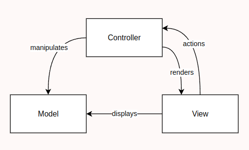
</p>

#### Consequences
Adopting the Model/View/Controller (MVC) pattern brings several key benefits, such as:
- **Improved Maintainability**: Clear separation between Model, View, and Controller makes it easier to maintain the code. Changes to one part of the system are less likely to impact others.
- **Easier Testing**: The modular structure allows for isolated testing of each component, making bug detection more efficient.
- **Scalability**: New features and expansions can be added without major changes to other parts of the system. The modular design makes the game easier to grow and adapt.
- **Decoupling**: The MVC pattern promotes a high level of decoupling, which simplifies development and reduces the impact of changes on other layers of the system.
- **Interface Maintenance**: UI changes can be made in the View without affecting game logic, allowing for faster updates and fewer errors.

### Managing a Single Instance of the Game Loop and GUI

#### Problem in Context

In a game, it's essential to control the execution flow, ensuring that certain components, like the game loop and the GUI, run in a controlled and consistent manner. As the game grows in complexity, there might be multiple components that need to interact with the game loop (such as updating entities, handling inputs, or rendering graphics) and with the GUI (such as changing it's type, drawing to it or even reopening). So, it's important that only one game loop and GUI exist at any given time to prevent issues like performance inconsistencies, redundant processing, or synchronization problems across different parts of the game. The challenge lies in ensuring that the management of the Game and GUI is centralized and accessed globally without being instantiated multiple times, especially as the game scales.

#### The Pattern
The Singleton Pattern is a design pattern used to ensure that a class has only one instance throughout the lifetime of the application and provides a global point of access to that instance. This pattern is particularly useful when a single, centralized object is needed to control or manage a resource, ensuring that it is not accidentally duplicated or instantiated multiple times.

Key characteristics of the Singleton pattern:
- **Single Instance**: The class can have only one instance, which is shared across the entire application.
- **Global Access**: The instance is globally accessible, usually through a static method.
- **Lazy Initialization**: The instance is created only when it is first needed, which optimizes memory usage.

#### Implementation
In the case of the Game Loop, we can apply the Singleton pattern to ensure that only one game loop exists during the entire game session. The loop would control the execution flow, managing the game’s updates, rendering, and logic processing.
The full implementation is provided on the Tenebris class [here](/src/main/java/com/ldts/t14g01/Tenebris/Tenebris.java).
About the GUI this pattern helps centralize all of it's logic, assuring that the GUI is always in a consistent state, and that no two GUIs can coexist, as that would break the game.
The Full implementation of the pattern is available in the LanternaGUI class [here](/src/main/java/com/ldts/t14g01/Tenebris/gui/LanternaGUI.java).

#### Consequences

Adopting the Singleton Pattern offers several advantages when managing critical systems like the Game Loop and GUI. It ensures centralized control by guaranteeing that only one instance of each system exists, preventing duplication and maintaining consistency throughout the application's lifecycle. This pattern provides a global access point, simplifying interactions and making it easier to manage dependencies without explicit passing of instances. Lazy initialization optimizes resource usage by creating the instance only when it is first needed, avoiding unnecessary memory consumption. Additionally, the Singleton ensures consistent state management, keeping shared systems stable and predictable, which is crucial for avoiding conflicts or synchronization issues. Debugging is also simplified, as there is only one instance to monitor, making it easier to diagnose and resolve problems. Overall, the Singleton Pattern enhances the stability, efficiency, and maintainability of complex systems.

### Managing the State of the Game

#### Problem in Context

As in any graphical application, changing contexts from one window to another or one menu to another is a big part of the whole graphical context. Specially in a game where there are multiple menus and even the game window itself, coordinating this switching can become confusing and scattered around the code base. This should be avoided, and a clear and centralized way of switching from one state to another should be implemented.

#### The Pattern

The state pattern is a behavioral design pattern used in software development to allow an object to alter its behavior when its internal state changes. This pattern is particularly useful for scenarios where an object's behavior is influenced by its state, and it helps organize code to make it more maintainable and scalable.

Key Components of the State Pattern
- **Context**: The main object that operates with different states. It maintains a reference to the current state object and delegates behavior to it.
- **State Interface**: Defines the common interface for all concrete states. This ensures the Context can interact with different states in a uniform manner.
- **Concrete States**: Implement the state interface and encapsulate specific behavior for a particular state. Each concrete state represents a unique behavior and transitions to other states as necessary.

#### Implementation

We created, as per the design, a generic `State<T>` Class and the necessary more specific implementations in junction with the MVC Design Pattern. This Classes can be found [here](/src/main/java/com/ldts/t14g01/Tenebris/state).

#### Consequences

The State Pattern improves code organization and maintainability by encapsulating each state's behavior into distinct classes, ensuring modularity and clarity. It simplifies adding or modifying states, enabling scalability without impacting existing ones. By centralizing transition logic, it eliminates redundancy and ensures consistent, predictable flows. Delegating behavior to state classes removes complex conditional structures and enhances dynamic control over application behavior. This approach reinforces the single responsibility principle, resulting in a more robust, flexible, and clean system.

### Command Pattern

#### Problem in Context

In a game, handling a wide variety of actions—such as creating or deleting objects, applying effects, and triggering animations—can result in tightly coupled and unmaintainable code. Scattering this logic across the codebase makes it harder to modify or extend, especially when new features are added. A centralized mechanism is needed to encapsulate these actions and execute them in a consistent and modular way.

#### The Pattern

The Command Pattern is a behavioral design pattern that encapsulates requests as objects, which allows to parameterize objects with operations, to delay their execution or to queue them. It is particularly effective for managing game actions, where diverse operations must be triggered dynamically.

Key Components of the Command Pattern:
- Command Interface: Defines the contract for executing commands.
- Concrete Commands: Implement the command interface and encapsulate specific game actions (e.g., creating effects, deleting objects).
- Invoker (Handler): The object responsible for triggering the execution of commands.
- Receiver: The object that performs the actual operation when the command is executed.
- Client: Configures the commands and their relationships with the invoker and receiver.

#### Implementation

In our game, the Command Pattern is used to encapsulate actions like creating and deleting objects (effects, particles, projectiles, walls, and monsters) and triggering dynamic behaviors (e.g., killing the main character or shaking the camera). Each of these operations is represented by a specific command, ensuring modularity and reuse. Our implementation can be found in the following [folder](/src/main/java/com/ldts/t14g01/Tenebris/model/arena/_commands).

#### Consequences

The Command Pattern brings the following benefits to managing game actions:
- Modularity: Each action (e.g., creating or deleting game objects, shaking the camera) is encapsulated in its own command class, making the code easier to understand and maintain.
- Extensibility: Adding new actions only requires creating new command classes without altering existing code.
- Centralized Execution: The CommandHandler ensures that all commands are handled consistently, enabling features like action queuing or batch processing.
- Dynamic Behavior: Commands can be composed, delayed, or executed conditionally, offering flexibility in gameplay mechanics.
This approach allows our game to scale while maintaining a clean, organized, and flexible architecture.

### Managing Arena Creation with the Factory Method Patterna

#### Problem in Context
In our game, constructing and initializing various elements like enemies, walls, and traps dynamically based on the level file and difficulty setting is a central challenge. Each game element requires specific configurations that change according to the selected difficulty (e.g., health, damage, vision range). Managing this complexity directly in the parsing logic would lead to scattered and unmaintainable code.

To address this, we needed a centralized approach to handle the creation of game elements, ensuring consistency and maintainability without overengineering the solution.

#### The Pattern
We adopted a factory-based approach for this problem. Rather than implementing the traditional Factory Method Pattern with interfaces and concrete factories, we opted for a simpler solution using static factory methods. These methods encapsulate the logic for creating and configuring objects based on the level file and difficulty.

Static factory methods are a design choice where object creation is handled by static methods in a utility class, making it easier to centralize creation logic while avoiding the need for additional factory instances.

Key Components of the Factory Method Pattern:

- Creator Class: Declares the factory method, which returns an object of a specific type.
- Concrete Creators: Override the factory method to produce specific types of objects.
- Product Interface: Defines the interface for the objects the factory creates.
- Concrete Products: Implement the product interface and define the behavior of the objects.

#### Implementation
In our implementation, the ArenaBuilder class coordinates the parsing of level files and delegates the creation of game elements to the correspondent utility static factory method (like createDylan and createSpike). This factory method accomplishes the task to build and configure objects dynamically. Our implementation is defined [here](/src/main/java/com/ldts/t14g01/Tenebris/model/arena/ArenaBuilder.jalike createDylan and createSpikeva).

#### Consequences
Using the Factory Method Pattern for arena building provides the following benefits:
- Centralized Creation Logic: All game element creation logic is centralized, ensuring consistency and making it easier to manage or modify.
- Simplified Implementation: Static factory methods eliminate the need for interfaces and additional factory classes, making the implementation straightforward while reducing boilerplate code.
- Perfomance: Static methods avoid the overhead of creating factory instances, improving runtime performance for object creation.
This pattern ensures that the arena creation process is both scalable and easy to maintain, aligning with the overall design goals of the game.

## Class Hierarchies

[comment]: <> (View Tree)

<h3 align="center">
  View Tree
</h3>

<p align="center">

</p>

[comment]: <> (Controller Tree)

<h3 align="center">
  Controller Tree
</h3>

<p align="center">

</p>

[comment]: <> (Game Element Tree)

<h3 align="center">
  Game Element Tree
</h3>

<p align="center">

</p>

## Code Smells

## Coverage Report

## Pitest Report
